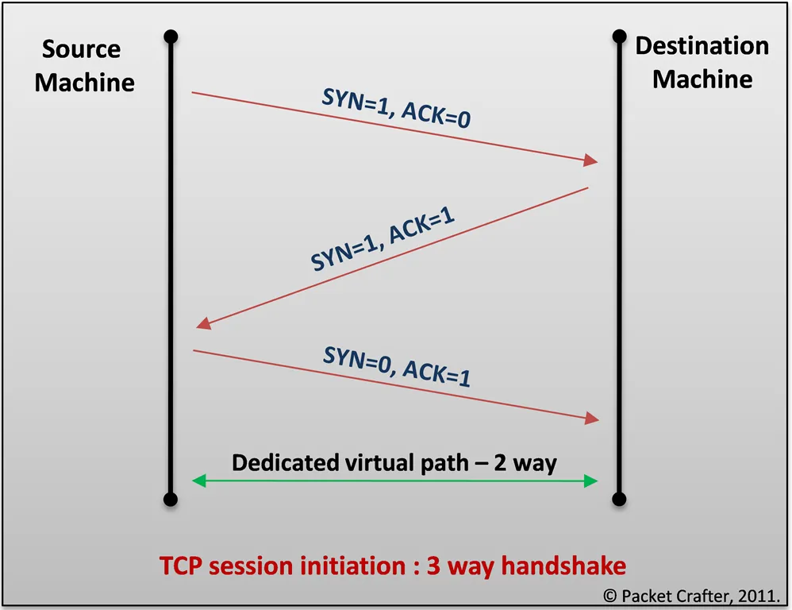

## Communication in the IoT
- Internet Principles
- __Internet Communications__ 
	- An Overview, IP, TCP, The IP Protocol Suite (TCP/IP), UDP, IP Addresses, DNS, Static IP Address Assignment, Dynamic IP Address Assignment, IPv6, MAC Addresses, TCP and UDP Ports
- __An Example:__ HTTP Ports, Other Common Ports
- __Application Layer Protocols__
	- HTTP
	- HTTPS: Encrypted HTTP
	- Other Application Layer Protocols.  

__Learning Outcomes__
• interpret different protocols and compare them
• select which protocol can be used for a specific application
• utilize the Internet communication protocols for IoT applications

---
### Internet Principles
> Chapter 3 in given E-book
---
### Internet Communications
#### IP
- In Internet Protocol version 4 (IPv4), almost 4.3 billion IP addresses are possible (2^32).
- An IPv4 address is a 32-bit address that is represented in dotted decimal notation, with a decimal value representing each of the four octets that make up the address (from 0.0.0.0 to 255.255.255.255)
- About 18 million addresses in three ranges are reserved for use in private networks. 
- Packets addresses in these ranges are not routable in the public Internet; they are ignored by all public routers. 
- Therefore, private hosts cannot directly communicate with public networks, but require network address translation(NAT) at a routing gateway for this purpose.
- An IP consists of a network part and host part that is determined by it's subnet.

__IP Address Classes__
[geeksforgeeks - blog](https://www.geeksforgeeks.org/introduction-of-classful-ip-addressing/)
[YouTube](https://www.youtube.com/watch?v=vcArZIAmnYQ&t=464s&ab_channel=SunnyClassroom)

__Reserved private IPv4 network ranges__

|Name|CIDR Block|Address Range|No. of Addresses|Classfull|
|-|-|-|-|-|
|24-bit Block|10.0.0.0/8|10.0.0.0 - 10.255.255.255|16777216|Class A|
|20-bit block|172.16.0.0/12|172.16.0.0 – 172.31.255.255|1048576|Class B|
|16-bit block|192.168.0.0/16|192.168.0.0 – 192.168.255.255|65536|Class C|

#### TCP
[YouTube](https://www.youtube.com/watch?v=xMtP5ZB3wSk&ab_channel=SunnyClassroom)
- TCP stands for Transmission Control Protocol
- It is a _reliable and connection-oriented_ transport protocol
- With TCP, data can be delivered successfully and accurately
- Many application such as web, email and FTP use TCP
- Before TCP transmit data, it'll use _three-way handshake_ to establish a connection
-  __Three-way Handshake:__
	- Client sends a SYN (synchronize) packet to server
	- If the server is up, it replies with SYN-ACK packet which means synchronization is acknowledged and asks for the client to open a connection
	-  The client replies with ACK (acknowledgement) with a connection open
	- Then the two way connection is established
	

	

#### TCP/IP Suite

#### UDP
#### IP Addresses

![[FSpdrzuUAAAS0BX.jpg | 750]]

#### Static IP Address Assignment
#### Dynamic IP Address Assignment
#### IPv6
#### MAC Addresses
#### TCP and UDP Ports
#### HTTP Ports, Other Common Ports

---
### Application Layer Protocols
#### HTTP
#### HTTPS
#### Other Application Layer Protocols
