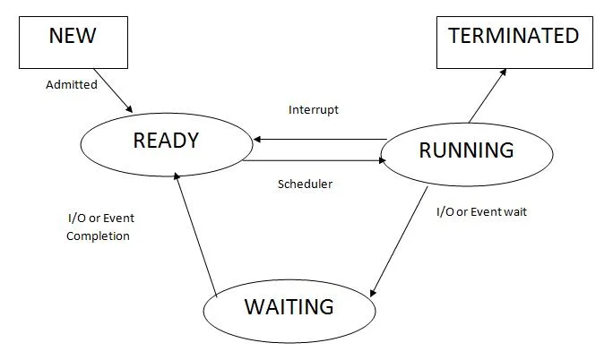

## Process Management and CPU Scheduling
__Process Management__ 
- Process concepts
- process scheduling
- Operations on processes
- inter-process communication  

__CPU Scheduling__
- Scheduling-criteria
- scheduling algorithms
- Thread scheduling
- Multiple processor scheduling
- algorithm evaluation
- Multithreaded programming
- Multi-core Programming
- Multi-threading Models
- Thread Libraries

__Learning Outcomes__
• demonstrate the concepts of Process, thread and CPU scheduling
• list out different scheduling algorithms
• analyse scheduling algorithms with different examples

---
### Process Management
[Process Management | neso academy](https://www.youtube.com/watch?v=OrM7nZcxXZU&ab_channel=NesoAcademy)

>__Process:__ A program in execution
__Thread:__ A thread is the unit of execution within a process. 

#### Process State
[Process State | neso academy](https://www.youtube.com/watch?v=jZ_6PXoaoxo&ab_channel=NesoAcademy)
>- As a process executes, it changes state
>- The state of a process is defined in part by the current activity of that process

- __New:__ The process  is being created
- __Ready:__ The process is waiting to be assinged to a processor
- __Running:__ Instructions are being executed
- __Waiting:__ The process is wiating for some event to occur such as I/O completion or reception of a signal
- __Terminated:__ The process has finished execution
 

#### Process concepts

#### process scheduling

#### Operations on processes

#### inter-process communication
